# Blood Omen: Legacy of Kain (GOG) 한글 패치

블러드 오멘 GOG 버전 한글 패치입니다.

본작은 원래 자막이 없는 게임이나 KainGL에서 영감을 받아 사운드가 재생될 때 자막을 표시합니다.

KainGL과 다르게 그래픽 등 GOG 원본 게임을 변경하지 않고 dll 파일로 사운드 후킹만 합니다.

자막은 폰트 및 크기 등을 설정할 수 있으며 실시간 반영됩니다.

원문의 느낌을 살리기 위해 최대한 직역했습니다.

버그가 있거나 개선할 점은 Issue에 의견을 남겨주시면 최대한 반영하겠습니다.

\* 블러드 오멘 2는 확인해봤는데 여러 가지 문제가 있어 리마스터가 나오기 전에는 한글 패치를 만들지 않습니다.

- **[다운로드 및 안내 페이지](https://devwock.github.io/lok-blood-omen-korean/)**
- [설치 방법 보기](#설치-방법)
- [GOG](https://www.gog.com/en/game/blood_omen_legacy_of_kain)

## 스크린샷

| | |
| --- | --- |
| 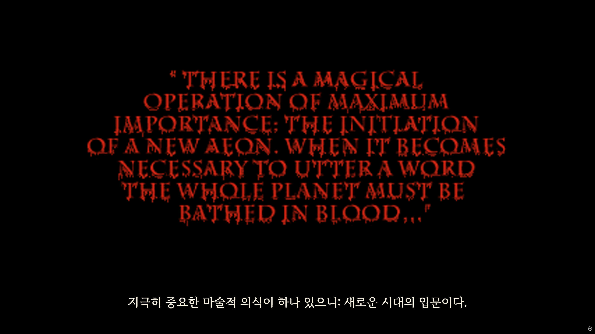 | 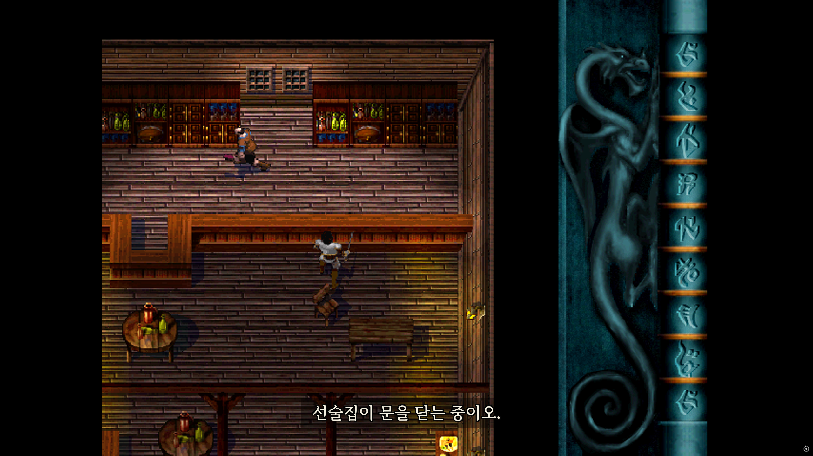 |
| 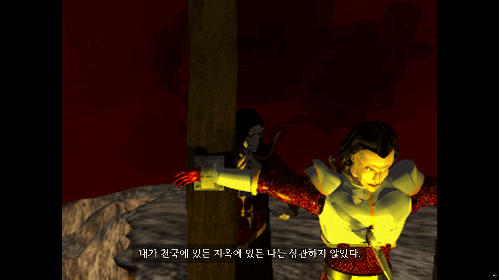 | 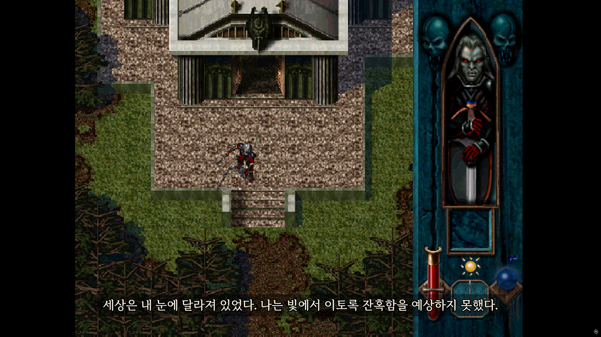 |
| 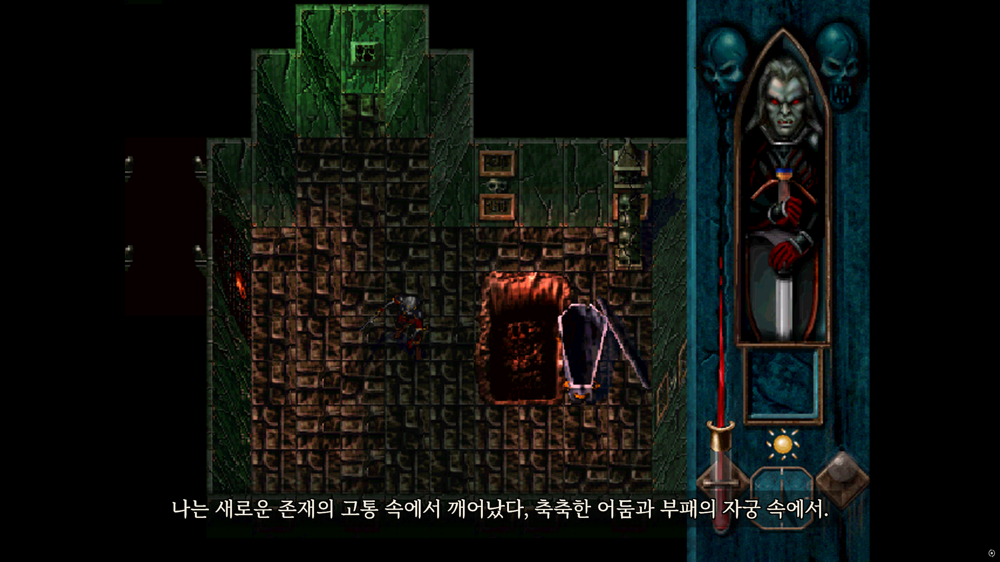 | 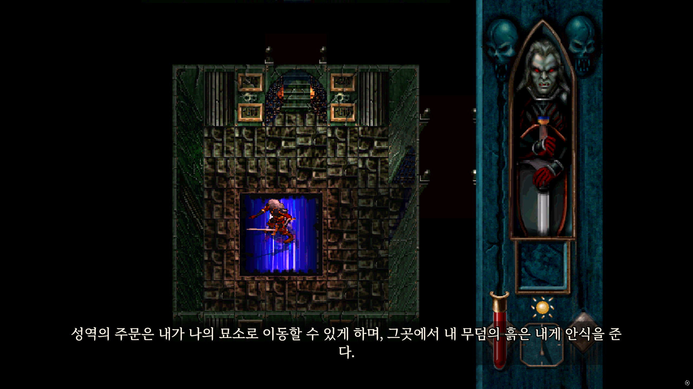 |
| 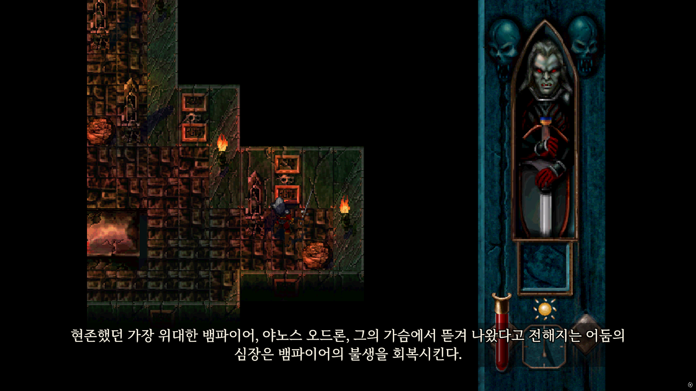 | 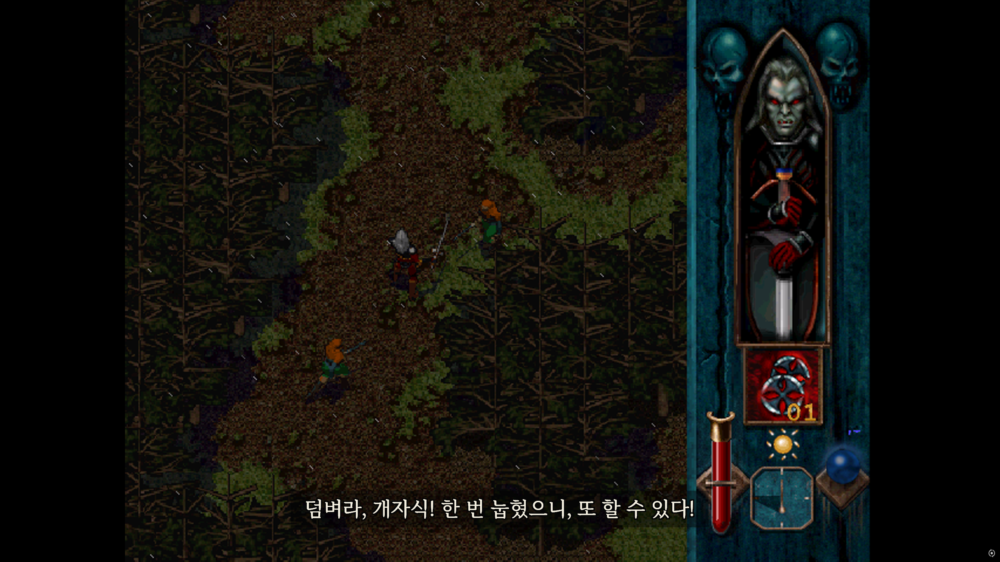 |

## 설치 방법

### 1. 게임 폴더 확인

GOG Galaxy에서 **Blood Omen: Legacy of Kain** 게임 상세 페이지로 들어가 **조절 버튼 - 설치 관리 - 설치 폴더 열기**를 눌러 파일 위치를 엽니다.

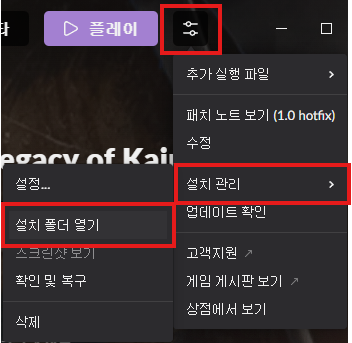

### 2. 파일 복사

다운로드한 압축 파일을 열어 게임 폴더 내로 복사합니다.

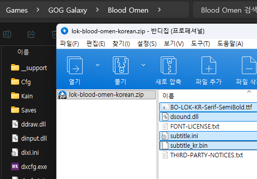

### 3. 자막 설정 변경

패치 파일 중 **subtitle.ini**를 메모장으로 편집하여 자막 설정을 할 수 있습니다. 편집하면 실시간 반영됩니다.

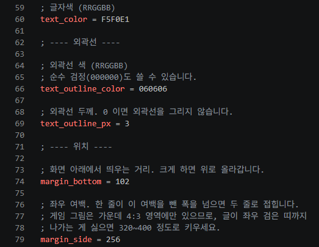

| 설정 | 설명 |
| --- | --- |
| **font_file** | 폰트 파일을 변경할 수 있습니다. \*.ttf, \*.otf를 지원합니다. |
| **font_px** | 폰트 크기를 변경할 수 있습니다. |
| **text_color** | 폰트 색상을 변경할 수 있습니다. RRGGBB 16진수 값입니다. |
| **text_outline_color** | 폰트 외곽선 색상을 변경할 수 있습니다. RRGGBB 16진수 값입니다. |
| **text_outline_px** | 폰트 외곽선 두께를 변경할 수 있습니다. |
| **margin_bottom** | 자막 위치를 변경할 수 있습니다. 하단 기준 위로 얼마나 올리냐를 정합니다. |
| **margin_side** | 자막 위치를 변경할 수 있습니다. 좌우 기준 양 옆으로 얼마나 좁히냐를 정합니다. |
| **bg_color** | 자막 박스 배경색 색상을 변경할 수 있습니다. RRGGBBAA 16진수 값입니다. |
| **bg_pad_x** | 자막 박스 크기를 변경할 수 있습니다. 글자 양 끝 기준으로 얼마나 좌우를 넓히냐를 정합니다. |
| **bg_pad_y** | 자막 박스 크기를 변경할 수 있습니다. 글자 양 끝 기준으로 얼마나 상하를 넓히냐를 정합니다. |

## 원본으로 복원하기

게임 폴더에서 다음 파일을 삭제합니다.

| 파일 | 설명 |
| --- | --- |
| **BO-LOK-KR-Serif-SemiBold.ttf** | 폰트 |
| **dsound.dll** | 게임 사운드 후킹 DLL |
| **subtitle_kr.bin** | 자막 |
| **subtitle.ini** | 자막 설정 |
| **FONT-LICENSE.txt** | 폰트 라이선스 |
| **THIRD-PARTY-NOTICES.txt** | 서드 파티 고지 |

## 릴리즈 노트

| 공개일 | 변경 내역 |
| --- | --- |
| 2026-09-30 | 최초 공개 |

## 개선할 점을 알려주세요.

어색한 표현, 오역, 버그, 제안을 남겨주시면 확인 후 반영하겠습니다.

- [GitHub Issue 열기](https://github.com/devwock/lok-blood-omen-korean/issues)

---

Unofficial Korean translation project for Blood Omen: Legacy of Kain.
